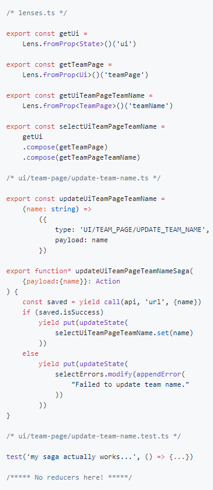

# optics

`optics` is a state management library for typescript apps based on [monocle-ts](https://github.com/gcanti/monocle-ts). It currently implements a single reducer and action creator, ready to be hooked in a standard redux setup.


## install

`npm install @myopia/optics`

## setup

In your store setup, just hook up the reducer provided. It's the only one you'll need.

You can either use the reducer and dispatch an action to set the initial state:

```typescript
import {createStore, applyMiddleware} from 'redux'
import {initialState, State} from './state.ts'
import {reducer, OpticsAction, updateState} from '@myopia/optics'

export const store =
    createStore<State, OpticsAction<State>, void, void>(
        reducer,
        applyMiddleware(...)
    )

store.dispatch(
  updateState<State>(_ => initialState)
)
```

Or use createReducer and pass your initial state

```typescript
import {createStore, applyMiddleware} from 'redux'
import {initialState, State} from './state.ts'
import {createReducer, OpticsAction, updateState} from '@myopia/optics'

export const store =
    createStore<State, OpticsAction<State>, void, void>(
        createReducer(initialState),
        applyMidleware(...)
    )
```

Your side effects layer is now ready to dispatch update actions:

```typescript

function* save(action) {
    const result = yield call(api, {data: action.payload})
    if (result.isSuccess)
        yield put(updateState(...))
}

```

## usage

Feel free to look at the example todos app, particularly the following files:

[todo actions](examples/todos/src/actions/todos.ts)

[visibility actions](examples/todos/src/actions/visibilityFilter.ts)

[lenses](examples/todos/src/lenses/index.ts)

#### What arguments do I pass to my update state?

Any lens composed from your state root

```typescript
// in your lenses

const getAuthentication = Lens.fromProp<State>()('authentication')
const getCurrentUser = Lens.fromProp<Authentication>()('currentUser')
const selectCurrentUser = getAuthentication.compose(getCurrentUser)

// in your saga

yield put(updateState(
    selectCurrentUser.set(newValue)
))

// you can also do multiple updates

yield put(updateState([
    selectName.set('New Name'),
    selectEmail.set('new@email.com'),
    selectAge.set(55),
]))
```

## 

Optics, more specifically lenses give you access to all getters and setters for every property of your state tree. Lenses are also composable so you can modify a deeply nested object property by passing a reference to the full object, and a function to update the specific property. All lenses operations are immutable.

## you're tired of writing reducers and selectors

As an example, let's say you want to retrieve some nested property from your state and show it in a view. Then you want to update it somehow. Here's a side by side comparison between the standard redux abstractions like selectors and reducers, and optics using [redux-saga](https://github.com/redux-saga/redux-saga) :

Standard               |  Optics
:---------------------:|:-------------------------:
 |

Note that we don't have to write tests for the reducers or selectors on the second case, because there are no reducers, and no selectors, just lenses.
Another benefit we gained for free here is that we remove all the possible "logic" from our reducers. Some random dev wouldn't even be able to

```typescript
(state, action) =>
    if (state.shouldDoLogicInReducer) ? "no" : "nope"
```

and make your reducer really hard to understand.
Optics also makes you think more generically about your update functions, since they are the only thing you should test. If you plan on updating a collection with a new value, write a generic collection append function, test it once and never again think about writing tests again.

## but wait, I still have to write all those lenses...


well, [not really](https://github.com/optics/optics-gen).

The optics generator should be able to generate all lenses from  basic typescript definitions, even across multiple files. It is under active development.

## dependencies

You'll want to get [monocle-ts](https://github.com/gcanti/monocle-ts) and [fp-ts](https://github.com/gcanti/fp-ts).

`optics` also extend `monocle-ts` and introduces the concept of [projections](https://github.com/optics/projections), which is a peer of this library.

`optics` shouldn't actually depend on redux at all, but we do export everything as a reducer and action creator to make use of the great devtools redux has.

## documentation

If you're looking for more information about optics in typescript, the [monocle-ts](https://github.com/gcanti/monocle-ts) website is a good start. More information will be added to the `optics` library as needed.

